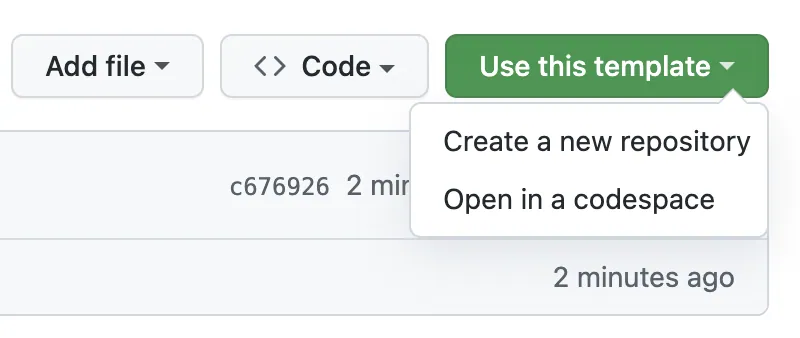

# 📦 单文件打包模板

一个通用的单文件打包解决方案，可以将复杂的Web项目打包成一个完全自包含的HTML文件。

## ✨ 特性

- **🏗️ 零配置** - 开箱即用，无需复杂设置
- **📦 完全内联** - 自动内联所有CSS、JavaScript、图片和JSON文件
- **🔧 智能处理** - 支持iframe内容、ServiceWorker禁用、相对路径解析

## 📋 支持的文件类型

| 类型 | 文件扩展名 | 处理方式 |
|------|------------|----------|
| JavaScript | `.js` | 内联到`<script>`标签 |
| CSS | `.css` | 内联到`<style>`标签 |
| 图片 | `.png`, `.jpg`, `.jpeg`, `.gif`, `.svg`, `.ico` | 转换为base64数据URL |
| JSON | `.json` (如manifest.json) | 转换为base64数据URL |
| HTML | iframe引用的HTML文件 | 内联为srcdoc属性 |

## 🚀 快速开始（3分钟）

### 使用模板

直接点击 Use this template 按钮即可创建模板。


> 更多说明，请见 GitHub 官方说明文档 https://docs.github.com/en/repositories/creating-and-managing-repositories/creating-a-repository-from-a-template

### 从源码使用

<details>
<summary>从源码使用</summary>
  
#### 第一步：复制模板
```bash
# 方法1：直接复制文件夹
cp -r build-single-html-file my-project
cd my-project

# 方法2：Git克隆
git clone https://github.com/Tosd0/build-single-html-file.git my-project
cd my-project
```

#### 第二步：安装依赖
```bash
npm install
```

#### 第三步：导入应用
将你需要打包的应用放在根目录下即可。

#### 第四步：构建
```bash
npm run build:single
```

#### 第五步：测试
```bash
# 手动测试
open dist/index.html  # macOS
start dist/index.html # Windows
```

</details>

## 📋 三种构建模式详解

| 构建模式 | 命令 | HTML | favicon | manifest | SW文件 | SW代码 | 适用场景 |
|----------|------|------|---------|----------|---------|---------|----------|
| **🎯 纯单文件** | `npm run build:single-pure` | ✅ | ❌ | ❌ | ❌ | ❌ 禁用 | 单文件分发 |
| **📦 默认模式** | `npm run build:single` | ✅ | ✅ | ✅ | ❌ | ❌ 禁用 | 一般Web应用、静态托管 |
| **📱 PWA模式** | `npm run build:single-pwa` | ✅ | ✅ | ✅ | ✅ | ✅ 保留  | 完整PWA、离线、节省请求数 |

### 🎯 纯单文件模式 - `npm run build:single-pure`

**输出文件**: 只有 `index.html`

**特点**:
- 真正的单文件，所有资源都内联
- 文件最小，便于分发
- ServiceWorker被完全禁用
- 无外部依赖（除了CDN资源）

**适用场景**:
- 📦 单文件最简打包分发

### 📦 默认模式 - `npm run build:single`

**输出文件**: `index.html`, `favicon.ico`, `manifest.json`

**特点**:
- 保留基本的Web应用文件
- ServiceWorker被禁用，避免单文件模式冲突
- 支持基本的PWA元数据（但无离线功能）
- 适合静态托管服务

**适用场景**:
- 🌍 静态网站托管（GitHub Pages、Vercel、Netlify）
- 📱 简单的移动端Web应用
- 🖥️ 桌面浏览器应用
- 🎨 展示型项目

### 📱 PWA模式 - `npm run build:single-pwa`

**输出文件**: `index.html`, `favicon.ico`, `manifest.json`, `service-worker.js`

**特点**:
- 完整的PWA功能支持
- ServiceWorker保留，提供离线缓存
- 支持推送通知
- 可安装到设备桌面
- 支持后台同步

**适用场景**:
- 📱 移动端PWA应用
- 🔄 需要离线功能的应用
- 📬 支持推送通知的应用
- 💾 需要本地缓存的应用
- 📦 保留所有功能的前提下最大程度减少 Edge Requests 请求数

### 文件处理策略

| 文件类型 | pure模式 | default模式 | pwa模式 |
|----------|----------|-------------|---------|
| CSS文件 | ✅ 内联到HTML | ✅ 内联到HTML | ✅ 内联到HTML |
| JS文件 | ✅ 内联到HTML | ✅ 内联到HTML | ✅ 内联到HTML |
| 图片资源 | ✅ Base64内联 | ✅ Base64内联 | ✅ Base64内联 |
| favicon.ico | ❌ 删除 | ✅ 保留 | ✅ 保留 |
| manifest.json | ❌ 删除 | ✅ 保留 | ✅ 保留 |
| service-worker.js | ❌ 不复制 | ❌ 不复制 | ✅ 复制 |

## 📁 推荐项目结构

```
your-project/
├── index.html              # 必须：主入口文件
├── style.css               # 推荐：主样式文件
├── script.js               # 推荐：主脚本文件
├── assets/                 # 推荐：资源目录
│   ├── images/             # 图片文件
│   ├── icons/              # 图标文件
│   └── fonts/              # 字体文件（注意：字体文件不会被内联）
├── components/             # 可选：组件文件
│   ├── header.html         # iframe内容
│   ├── header.js           # 组件脚本
│   └── header.css          # 组件样式
├── manifest.json           # 可选：PWA清单
├── favicon.ico             # 推荐：网站图标
├── service-worker.js       # 可选：ServiceWorker（PWA）
├── package.json            # 项目依赖
├── vite.config.js          # Vite配置文件
├── scripts/                # 构建脚本
│   ├── build-single-file.js
│   └── test-single-file.js
└── .github/workflows/      # GitHub Actions（可选）
    └── build-single-file.yml
```

## 🔧 技术实现详解

### ServiceWorker 处理策略

#### 禁用模式（pure + default）
```javascript
// 原始代码
if ('serviceWorker' in navigator) {
    navigator.serviceWorker.register('/service-worker.js');
}

// 构建后
console.log('ServiceWorker disabled in single-file mode');
```

#### 保留模式（pwa）
```javascript
// 代码保持原样，完整功能
if ('serviceWorker' in navigator) {
    navigator.serviceWorker.register('/service-worker.js')
        .then(registration => {
            console.log('SW registered:', registration.scope);
        });
}
```

## 🔄 日常工作流

### 开发模式
```bash
# 启动开发服务器（可选）
npm run dev

# 修改你的文件...
# 保存后重新构建
npm run build:single

# 快速验证
open dist/index.html
```

### 生产模式
```bash
# 构建生产版本（带时间戳备份）
npm run build:single

# 或者只生成单个文件
npm run build:single
```

## 🖼️ 资源处理策略

### 图片优化
```bash
# 构建前优化图片大小
# 推荐工具：imagemin, tinypng, squoosh

# 建议的图片格式和大小：
# - 图标：PNG, 32x32 或 64x64
# - 照片：JPEG, 宽度不超过1920px
# - 简单图形：SVG
```

### 字体文件处理
```css
/* 字体文件不会被内联，使用Web字体或系统字体 */
@import url('https://fonts.googleapis.com/css2?family=Inter:wght@300;400;600&display=swap');

/* 或者使用系统字体栈 */
font-family: -apple-system, BlinkMacSystemFont, 'Segoe UI', Roboto, sans-serif;
```

## 🌐 iframe内容管理

### 创建iframe页面
```html
<!-- components/sidebar.html -->
<!DOCTYPE html>
<html>
<head>
    <meta charset="UTF-8">
    <style>
        body { padding: 20px; background: #f5f5f5; }
        .sidebar-content { background: white; padding: 15px; }
    </style>
</head>
<body>
    <div class="sidebar-content">
        <h3>侧边栏内容</h3>
        <p>这个内容会被内联到主文件中</p>
    </div>
    <script>
        console.log('侧边栏脚本已加载');
    </script>
</body>
</html>
```

### 在主页面中使用
```html
<!-- index.html -->
<iframe src="components/sidebar.html" width="300" height="400"></iframe>
```

## 💡 最佳实践建议

### 开发阶段
```bash
# 使用默认模式进行开发和测试
npm run build:single
```

### 生产部署
```bash
# 静态托管
npm run build:single

# PWA应用
npm run build:single-pwa

# 文件分发
npm run build:single-pure
```

## ⚙️ 环境变量

- `CREATE_TIMESTAMP` - 是否创建时间戳版本（默认: `true`）

```bash
# 跳过时间戳版本创建
CREATE_TIMESTAMP=false npm run build:single
```

## 🔧 高级配置

### Vite配置自定义

你可以根据需要修改`vite.config.js`中的配置：

```javascript
export default defineConfig({
  plugins: [
    // 可以调整插件顺序或添加自定义插件
    inlineJavaScriptPlugin(),
    inlineStaticAssetsPlugin(),
    // ...
  ],
  build: {
    // 可以调整构建选项
    minify: true, // 启用压缩
    assetsInlineLimit: 100000000, // 内联限制
  }
});
```

### 自定义构建过程
```javascript
// vite.config.js 自定义示例

// 添加自定义插件
function customPlugin() {
    return {
        name: 'custom-processing',
        transformIndexHtml: {
            enforce: 'post',
            transform(html, context) {
                // 自定义HTML处理逻辑
                return html.replace(/{{TIMESTAMP}}/g, new Date().toISOString());
            }
        }
    };
}

export default defineConfig({
    plugins: [
        // 现有插件...
        customPlugin(), // 添加自定义插件
        viteSingleFile()
    ]
});
```

### 条件构建
```html
<!-- 在HTML中使用条件注释 -->
<!-- SINGLE_FILE_MODE_START -->
<p>这段内容只在单文件模式下显示</p>
<!-- SINGLE_FILE_MODE_END -->
```

## 📊 性能优化

### 减小文件大小
```javascript
// vite.config.js
export default defineConfig({
    build: {
        minify: 'terser', // 启用代码压缩
        terserOptions: {
            compress: {
                drop_console: true, // 移除console语句
                drop_debugger: true // 移除debugger语句
            }
        }
    }
});
```

### 优化加载性能
```html
<!-- 使用适当的meta标签 -->
<meta charset="UTF-8">
<meta name="viewport" content="width=device-width, initial-scale=1.0">

<!-- 预加载关键资源 -->
<link rel="preload" href="fonts/important.woff2" as="font" type="font/woff2" crossorigin>
```

## 🔍 调试

### 构建问题排查
```bash
# 启用详细构建日志
npm run build:single-debug

# 检查构建输出
ls -la dist/
file dist/index.html

# 验证文件完整性
open dist/index.html
```

### 运行时问题排查
```javascript
// 在生成的文件中添加调试代码
console.log('App loaded at:', new Date());
console.log('File size:', document.documentElement.outerHTML.length);
console.log('Location:', window.location);
```

## 💡 实用技巧

### 版本管理
```bash
# 自动生成带版本号的文件名
BUILD_VERSION=$(date +%Y%m%d_%H%M%S) npm run build:single
```

### 批量处理
```bash
# 批量构建多个项目
for project in project1 project2 project3; do
    cd $project
    npm run build:single
    cd ..
done
```

### 内容验证
```bash
# 验证生成的文件内容
grep -c "<script>" dist/index.html  # 统计script标签数量
grep -c "<style>" dist/index.html   # 统计style标签数量
```

## 🚀 GitHub Actions集成

模板包含预配置的GitHub Actions工作流：

```yaml
# .github/workflows/build-single-file.yml
name: Build Single File

on: [push, pull_request]

jobs:
  build:
    runs-on: ubuntu-latest
    steps:
      - uses: actions/checkout@v4
      - uses: actions/setup-node@v4
      - run: npm ci
      - run: npm run build:single
      - uses: actions/upload-artifact@v4
        with:
          name: single-file-build
          path: dist/
```

## 🔍 故障排除

### 常见问题

**Q: 构建后某些图片无法显示**
A: 检查图片路径是否正确，确保文件存在于指定位置，或图片过大，转Base64时出现问题。

**Q: JavaScript功能不工作**
A: 在浏览器控制台查看错误信息，检查JavaScript语法错误。

**Q: 文件太大**
A: 考虑压缩图片资源，或者在vite.config.js中启用minify选项。

**Q: CORS错误**
A: 使用本地服务器而不是file://协议打开文件。

**Q: ServiceWorker在单文件模式下不工作？**
A: 这是预期行为。pure和default模式会禁用SW，避免路径冲突。

**Q: PWA模式下某些功能不工作？**
A: 检查service-worker.js文件是否存在，确保路径正确。

## 📝 许可证

MIT License - 详见 [LICENSE](LICENSE) 文件

## 🤝 贡献

欢迎提交Issue和Pull Request来改进这个模板！